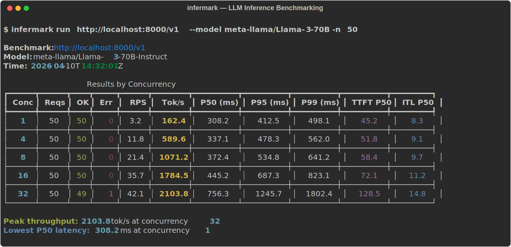
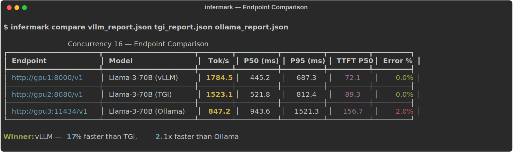

# infermark

**Know how fast your LLM endpoint actually is.**

infermark benchmarks any OpenAI-compatible API endpoint — vLLM, TGI, Ollama, SGLang, or anything behind `/v1/chat/completions`. It measures what matters: time to first token, inter-token latency, throughput under load, and tail latencies. One command, no config files, real numbers.

Both [llmperf](https://github.com/ray-project/llmperf) and [llm-bench](https://github.com/bentoml/llm-bench) were archived in 2025. infermark fills the gap.



## What it measures

| Metric | What it tells you |
|--------|-------------------|
| **TTFT** | Time to first token — how long until streaming starts |
| **ITL** | Inter-token latency — smoothness of the stream |
| **Throughput** (tok/s) | Output tokens per second across all concurrent requests |
| **P50 / P95 / P99** | Tail latency distribution at each concurrency level |
| **Error rate** | Failed requests under load |
| **RPS** | Requests per second the server can sustain |

## Install

```bash
pip install infermark
```

With the CLI (rich tables, progress):

```bash
pip install infermark[cli]
```

## Quick start

### CLI

```bash
# Benchmark a local vLLM server
infermark run http://localhost:8000/v1 --model meta-llama/Llama-3-70B -n 50

# Sweep concurrency levels
infermark run http://localhost:8000/v1 -c 1,4,8,16,32,64 -n 100

# Save results as JSON
infermark run http://localhost:8000/v1 -o results.json

# Compare multiple endpoints
infermark compare vllm.json tgi.json ollama.json
```

### Python

```python
from infermark import BenchmarkConfig, run_benchmark

config = BenchmarkConfig(
    url="http://localhost:8000/v1",
    model="meta-llama/Llama-3-70B-Instruct",
    concurrency_levels=[1, 4, 8, 16, 32],
    n_requests=100,
    max_tokens=256,
)

report = run_benchmark(config)

# Best throughput
best = report.best_throughput()
print(f"Peak: {best.tokens_per_second:.1f} tok/s at concurrency {best.concurrency}")

# Lowest latency
low = report.lowest_latency()
print(f"Lowest P50: {low.latency.p50 * 1000:.1f} ms at concurrency {low.concurrency}")
```

### Async

```python
import asyncio
from infermark import BenchmarkConfig, run_benchmark_async

async def main():
    config = BenchmarkConfig(url="http://localhost:8000/v1", model="llama-3")
    report = await run_benchmark_async(config)
    print(f"Peak throughput: {report.best_throughput().tokens_per_second:.1f} tok/s")

asyncio.run(main())
```

## Compare endpoints

Find out whether vLLM, TGI, or Ollama is faster for your model and hardware:



```bash
# Benchmark each endpoint separately
infermark run http://gpu1:8000/v1 --model llama-3 -o vllm.json
infermark run http://gpu2:8080/v1 --model llama-3 -o tgi.json
infermark run http://gpu3:11434/v1 --model llama-3 -o ollama.json

# Side-by-side comparison
infermark compare vllm.json tgi.json ollama.json
```

## Export formats

```bash
# JSON (for programmatic analysis)
infermark run http://localhost:8000/v1 -o report.json

# Markdown (paste into docs/PRs)
infermark run http://localhost:8000/v1 --markdown report.md
```

## Configuration

```python
BenchmarkConfig(
    url="http://localhost:8000/v1",     # Any OpenAI-compatible endpoint
    model="meta-llama/Llama-3-70B",     # Model name
    prompt="Explain relativity.",        # Prompt to send
    max_tokens=256,                      # Max output tokens per request
    concurrency_levels=[1, 4, 8, 16],   # Test these concurrency levels
    n_requests=100,                      # Requests per level
    timeout=120.0,                       # Per-request timeout (seconds)
    mode=BenchmarkMode.STREAMING,        # STREAMING or NON_STREAMING
    warmup=3,                            # Warmup requests before measurement
    api_key="sk-...",                    # Optional API key
)
```

## How it works

1. **Warmup** — Sends a few requests to prime the server's KV cache and JIT compilation
2. **For each concurrency level** — Fires N requests with M concurrent workers using `asyncio`
3. **Streaming measurement** — Parses SSE chunks to measure TTFT and inter-token latency
4. **Statistics** — Computes P50/P75/P90/P95/P99, mean, min, max, std from raw timings
5. **Report** — Rich terminal tables, JSON, or Markdown output

## Supported endpoints

Anything that speaks the OpenAI chat completions API:

- [vLLM](https://github.com/vllm-project/vllm)
- [Text Generation Inference (TGI)](https://github.com/huggingface/text-generation-inference)
- [SGLang](https://github.com/sgl-project/sglang)
- [Ollama](https://ollama.ai) (with `OLLAMA_ORIGINS=*`)
- [llama.cpp server](https://github.com/ggerganov/llama.cpp)
- [LiteLLM proxy](https://github.com/BerriAI/litellm)
- OpenAI, Anthropic (via compatible proxy), Together, Fireworks, etc.

## License

Apache-2.0
